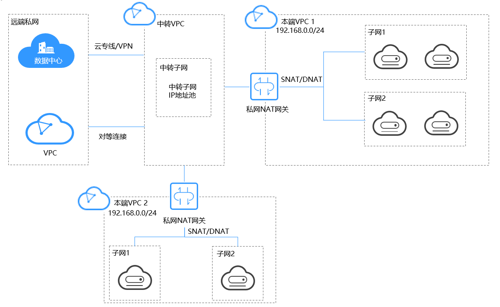
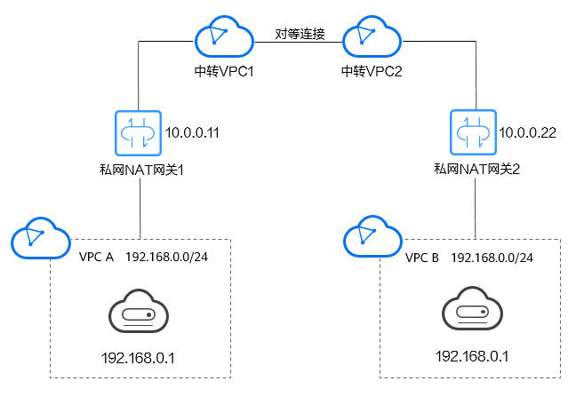
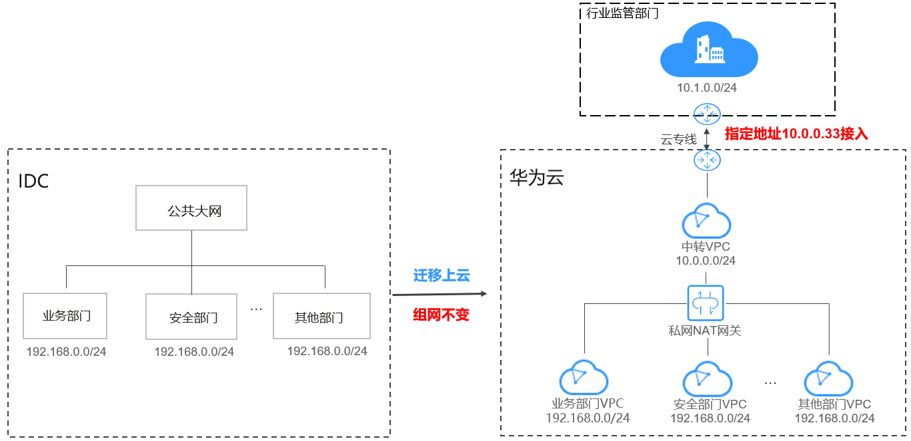

# 私网NAT网关简介

## 什么是私网NAT网关？

私网NAT网关（Private NAT Gateway），能够为虚拟私有云内的云主机（弹性云服务器、裸金属服务器）提供私网地址转换服务。您可以在私网NAT网关上配置SNAT、DNAT规则，可将源、目的网段地址转换为中转IP，通过使用中转IP实现VPC内的云主机与其他VPC、云下IDC互访。

私网NAT网关分为SNAT和DNAT两个功能：

-   SNAT功能通过绑定中转IP，可实现VPC内跨可用区的多个云主机共享中转IP，访问外部数据中心或其他VPC。
-   DNAT功能通过绑定中转IP，可实现IP映射或端口映射，使VPC内跨可用区的多个云主机共享中转IP，为外部私网提供服务。

**中转子网**

中转子网相当于一个中转网络，您可以在中转子网中创建私网IP，即中转IP，使本端VPC中的云主机可以共享该中转IP访问用户IDC或其他远端VPC。

**中转VPC**

中转子网所在VPC。

**图 1**  私网NAT网关  

如[图1](#fig105783104403)所示：

-   重叠网段的VPC互访

    两个本端VPC网段重叠，使用两个私网NAT网关，配置SNAT、DNAT规则，将本端VPC私网地址转换为中转IP地址，实现两个本端VPC中云主机利用中转IP互访，解决了VPC间网段重叠互访的问题。

-   指定IP接入远端私网

    访问远端私网中的用户数据中心（IDC）和VPC被要求指定IP地址接入，远端私网中的IDC通过云专线/VPN接入中转VPC，远端私网中的VPC通过对等连接接入中转VPC。本端VPC1使用私网NAT网关，配置SNAT规则，将本端VPC私网地址转换为指定IP地址，实现本端VPC1中的云主机以指定IP地址接入远端私网。

    > **说明：** 
    >-   私网NAT网关目前在“华东-上海二”、“西南-贵阳一”、“中国-香港”、“拉美-圣保罗一”、“非洲-约翰内斯堡”、“拉美-墨西哥城一”限时免费。
    >-   私网NAT网关目前在“华南-广州-友好用户环境”、“华南-广州”、“华东-上海一”、“华北-北京四”、“华北-乌兰察布一”、“亚太-曼谷”、“亚太-新加坡”已开始计费。

## 产品优势

-   简规划

    企业从线下IDC迁移部分业务上云后，希望保持原先企业内部网络通信方式，私网NAT可将业务VPC下云主机的IP转换为中转VPC下的中转IP，并与远端IDC或其他VPC进行三层通信，助力企业业务零改造、简化网络规划。

-   零冲突

    利用两个私网NAT网关，可将两重叠网段的VPC进行地址转换，实现两个VPC下的云主机互访，解决网段重叠互访问题。

-   高安全

    私网NAT网关提供私网IP地址映射为满足企业安全规范的IP地址，接入指定部门，提升安全性。

## 应用场景

-   重叠网段VPC间互通

    私网NAT网关提供私网地址转换服务，利用两个私网NAT网关，配置SNAT、DNAT规则，可同时将源、目的网段地址转换为中转IP，通过使用中转IP实现两VPC间互通。私网NAT网关解决了两个重叠网段虚拟私有云中的云主机互相访问的问题。

    如下图所示，创建一个中转VPC，然后使用两个私网NAT网关将VPC A中IP地址为192.168.0.1的弹性云服务器地址转化为10.0.0.11、将VPC B中IP地址为192.168.0.1的弹性云服务器地址转化为10.0.0.22，通过转化后的IP地址相互访问。

    **图 2**  重叠网段VPC间互通  
    

-   企业网络上云及指定IP接入

    大企业等机构上云，希望迁移上云保持组网不变，使用私网NAT网关无需对网络做任何更改即可保持原有方式互通。同时，行业监管部门要求指定地址接入，使用私网NAT网关将各部门的IP地址映射为指定地址接入行业监管部门，满足企业安全规范。

    如下图所示，企业部门间存在网段重叠，使用私网NAT网关，实现企业各部门迁移上云后组网不变，部门间保持原有方式互通，简化了IDC上云的网络规划；使用私网NAT网关，配置SNAT规则，将各部门的IP地址映射为符合要求的10.0.0.33地址接入行业监管部门，提升企业的安全性。

    **图 3**  企业网络上云及指定IP接入  
    

## 公网NAT网关与私网NAT网关对比

公网NAT网关通过配置SNAT规则将私有IP映射为弹性公网IP，实现VPC内的云主机通过共享弹性公网IP访问互联网；配置DNAT规则共享弹性公网IP为公网提供服务。

私网NAT网关通过配置SNAT规则将私有IP映射为中转IP，实现VPC内的云主机访问私网中的用户数据中心或其他VPC；配置DNAT规则共享中转IP为私网提供服务。

[表1](#table3924422163214)概括了公网NAT网关和私网NAT网关间的差异：

**表 1**  公网NAT网关与私网NAT网关对比

<table><thead align="left"><tr id="row199257226329"><th class="cellrowborder" valign="top" width="13.041304130413039%" id="mcps1.2.4.1.1">
功能项

</th>
<th class="cellrowborder" valign="top" width="37.063706370637064%" id="mcps1.2.4.1.2">
公网NAT网关

</th>
<th class="cellrowborder" valign="top" width="49.89498949894989%" id="mcps1.2.4.1.3">
私网NAT网关

</th>
</tr>
</thead>
<tbody><tr id="row792562220321"><td class="cellrowborder" valign="top" width="13.041304130413039%" headers="mcps1.2.4.1.1 ">
功能

</td>
<td class="cellrowborder" valign="top" width="37.063706370637064%" headers="mcps1.2.4.1.2 ">
私网和公网间互通

</td>
<td class="cellrowborder" valign="top" width="49.89498949894989%" headers="mcps1.2.4.1.3 ">
私网和私网间互通

</td>
</tr>
<tr id="row1492552213212"><td class="cellrowborder" valign="top" width="13.041304130413039%" headers="mcps1.2.4.1.1 ">
SNAT功能

</td>
<td class="cellrowborder" valign="top" width="37.063706370637064%" headers="mcps1.2.4.1.2 ">
访问公网

</td>
<td class="cellrowborder" valign="top" width="49.89498949894989%" headers="mcps1.2.4.1.3 ">
访问私网中的IDC或其他VPC

</td>
</tr>
<tr id="row16998184903515"><td class="cellrowborder" valign="top" width="13.041304130413039%" headers="mcps1.2.4.1.1 ">
DNAT功能

</td>
<td class="cellrowborder" valign="top" width="37.063706370637064%" headers="mcps1.2.4.1.2 ">
为公网提供服务

</td>
<td class="cellrowborder" valign="top" width="49.89498949894989%" headers="mcps1.2.4.1.3 ">
为私网中的IDC或其他VPC提供服务

</td>
</tr>
<tr id="row1365512164365"><td class="cellrowborder" valign="top" width="13.041304130413039%" headers="mcps1.2.4.1.1 ">
互通媒介

</td>
<td class="cellrowborder" valign="top" width="37.063706370637064%" headers="mcps1.2.4.1.2 ">
弹性公网IP

</td>
<td class="cellrowborder" valign="top" width="49.89498949894989%" headers="mcps1.2.4.1.3 ">
中转IP

</td>
</tr>
</tbody>
</table>

## 相关链接

[使用私网NAT网关为VPC内计算实例实现线上线下互通](https://support.huaweicloud.com/qs-natgateway/nat_qs_0020.html)

