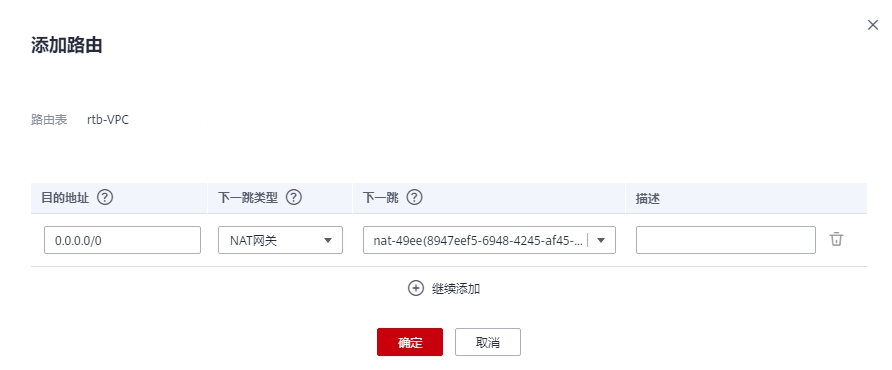

# 购买公网NAT网关

## 操作场景

如果您要通过公网NAT网关访问公网或为公网提供服务，则需要购买公网NAT网关。

## 前提条件

-   购买公网NAT网关必须指定公网NAT网关所在VPC、子网。
-   由于需要放通到公网NAT网关的流量，即在VPC中需要有指向公网NAT网关的路由，因此在购买公网NAT网关时，会自动在VPC的默认路由表中添加一条0.0.0.0/0的默认路由指向所购买的公网NAT网关。如果在购买公网NAT网关前，VPC默认路由表下已经存在0.0.0.0/0的默认路由，则会导致自动添加该默认路由指向公网NAT网关失败，此时需要在公网NAT网关购买成功后，手动为此网关添加一条不同的路由或在新路由表中创建0.0.0.0/0的默认路由指向该网关。

## 操作步骤

1.  登录管理控制台。
2.  在管理控制台左上角单击，选择区域和项目。
3.  在系统首页，单击“网络 \> NAT网关”。

    进入公网NAT网关页面。

4.  在公网NAT网关页面，单击“购买公网NAT网关”，进入公网NAT网关购买页面。
5.  根据界面提示，配置公网NAT网关的基本信息，配置参数请参见[表1](#zh-cn_topic_0259133770_table27487005195751)。

    **表 1**  参数说明

    
    <table><thead align="left"><tr id="zh-cn_topic_0259133770_row9940336195751"><th class="cellrowborder" valign="top" width="31.740000000000002%" id="mcps1.2.3.1.1">
参数

    </th>
    <th class="cellrowborder" valign="top" width="68.26%" id="mcps1.2.3.1.2">
参数说明

    </th>
    </tr>
    </thead>
    <tbody><tr id="zh-cn_topic_0259133770_row23152322195751"><td class="cellrowborder" valign="top" width="31.740000000000002%" headers="mcps1.2.3.1.1 ">
计费模式

    </td>
    <td class="cellrowborder" valign="top" width="68.26%" headers="mcps1.2.3.1.2 ">
公网NAT网关支持按需计费、包年/包月。

    </td>
    </tr>
    <tr id="zh-cn_topic_0259133770_row93821753517"><td class="cellrowborder" valign="top" width="31.740000000000002%" headers="mcps1.2.3.1.1 ">
区域

    </td>
    <td class="cellrowborder" valign="top" width="68.26%" headers="mcps1.2.3.1.2 ">
公网NAT网关所在的区域。

    </td>
    </tr>
    <tr id="zh-cn_topic_0259133770_row32613315195751"><td class="cellrowborder" valign="top" width="31.740000000000002%" headers="mcps1.2.3.1.1 ">
名称

    </td>
    <td class="cellrowborder" valign="top" width="68.26%" headers="mcps1.2.3.1.2 ">
公网NAT网关名称。最大支持64个字符，仅支持数字、字母、_（下划线）、-（中划线）。

    </td>
    </tr>
    <tr id="zh-cn_topic_0259133770_row27553870195751"><td class="cellrowborder" valign="top" width="31.740000000000002%" headers="mcps1.2.3.1.1 ">
虚拟私有云

    </td>
    <td class="cellrowborder" valign="top" width="68.26%" headers="mcps1.2.3.1.2 ">
公网NAT网关所属的VPC。

    
VPC仅在购买公网NAT网关时可以选择，后续不支持修改。

    
 说明： 

由于需要放通到公网NAT网关的流量，即在VPC中需要有指向公网NAT网关的路由，因此在购买公网NAT网关时，会自动在VPC的默认路由表中添加一条0.0.0.0/0的默认路由指向所购买的公网NAT网关。如果在购买公网NAT网关前，VPC默认路由表下已经存在0.0.0.0/0的默认路由，则会导致自动添加该默认路由指向公网NAT网关失败，此时需要在公网NAT网关购买成功后，手动为此网关添加一条不同的路由或在新路由表中创建0.0.0.0/0的默认路由指向该网关。

    

    </td>
    </tr>
    <tr id="zh-cn_topic_0259133770_row47407746195751"><td class="cellrowborder" valign="top" width="31.740000000000002%" headers="mcps1.2.3.1.1 ">
子网

    </td>
    <td class="cellrowborder" valign="top" width="68.26%" headers="mcps1.2.3.1.2 ">
公网NAT网关所属VPC中的子网。

    
子网至少有一个可用的IP地址。

    
子网仅在购买公网NAT网关时可以选择，后续不支持修改。

    </td>
    </tr>
    <tr id="zh-cn_topic_0259133770_row3011590195751"><td class="cellrowborder" valign="top" width="31.740000000000002%" headers="mcps1.2.3.1.1 ">
规格

    </td>
    <td class="cellrowborder" valign="top" width="68.26%" headers="mcps1.2.3.1.2 ">
公网NAT网关的规格。

    
公网NAT网关共有小型、中型、大型和超大型四种规格类型，可通过“了解更多”查看各规格详情。

    </td>
    </tr>
    <tr id="zh-cn_topic_0259133770_row98721653013"><td class="cellrowborder" valign="top" width="31.740000000000002%" headers="mcps1.2.3.1.1 ">
企业项目

    </td>
    <td class="cellrowborder" valign="top" width="68.26%" headers="mcps1.2.3.1.2 ">
配置公网NAT网关归属的企业项目。当公网NAT网关配置企业项目时，该公网NAT网关将归属于该企业项目。当没有指定企业项目时，将默认使用项目名称为default的企业项目。

    </td>
    </tr>
    <tr id="zh-cn_topic_0259133770_row2219225792544"><td class="cellrowborder" valign="top" width="31.740000000000002%" headers="mcps1.2.3.1.1 ">
描述

    </td>
    <td class="cellrowborder" valign="top" width="68.26%" headers="mcps1.2.3.1.2 ">
公网NAT网关信息描述。最大支持255个字符。

    </td>
    </tr>
    <tr id="zh-cn_topic_0259133770_row29995813516"><td class="cellrowborder" valign="top" width="31.740000000000002%" headers="mcps1.2.3.1.1 ">
标签

    </td>
    <td class="cellrowborder" valign="top" width="68.26%" headers="mcps1.2.3.1.2 ">
公网NAT网关的标识，包括键和值。可以创建10个标签。

    
标签的命名规则请参考<a href="#zh-cn_topic_0259133770_zh-cn_topic_0030971658_zh-cn_topic_0013935842_table248245914136">表2</a>。

    </td>
    </tr>
    <tr id="zh-cn_topic_0259133770_row105571852134014"><td class="cellrowborder" valign="top" width="31.740000000000002%" headers="mcps1.2.3.1.1 ">
购买时长

    </td>
    <td class="cellrowborder" valign="top" width="68.26%" headers="mcps1.2.3.1.2 ">
公网NAT网关购买时长。

    </td>
    </tr>
    </tbody>
    </table>

    **表 2**  标签命名规则

    
    <table><thead align="left"><tr id="zh-cn_topic_0259133770_zh-cn_topic_0030971658_zh-cn_topic_0013935842_zh-cn_topic_0067805752_zh-cn_topic_0013859511_row2997812223119"><th class="cellrowborder" valign="top" width="12.049999999999999%" id="mcps1.2.3.1.1">
参数

    </th>
    <th class="cellrowborder" valign="top" width="87.94999999999999%" id="mcps1.2.3.1.2">
规则

    </th>
    </tr>
    </thead>
    <tbody><tr id="zh-cn_topic_0259133770_zh-cn_topic_0030971658_zh-cn_topic_0013935842_zh-cn_topic_0067805752_zh-cn_topic_0013859511_row5695691323119"><td class="cellrowborder" valign="top" width="12.049999999999999%" headers="mcps1.2.3.1.1 ">
键

    </td>
    <td class="cellrowborder" valign="top" width="87.94999999999999%" headers="mcps1.2.3.1.2 "><ul id="zh-cn_topic_0259133770_zh-cn_topic_0030971658_zh-cn_topic_0013935842_zh-cn_topic_0067805752_zh-cn_topic_0013859511_ul2321196023222"><li>不能为空。</li><li>对于同一NAT网关键值唯一。</li><li>长度不超过36个字符。</li><li>不能包含“=”、“*”、“&lt;”、“&gt;”、“\\”、“,”、“|”和“/”，且首尾字符不能为空格。</li></ul>
    </td>
    </tr>
    <tr id="zh-cn_topic_0259133770_zh-cn_topic_0030971658_zh-cn_topic_0013935842_zh-cn_topic_0067805752_zh-cn_topic_0013859511_row1973304523119"><td class="cellrowborder" valign="top" width="12.049999999999999%" headers="mcps1.2.3.1.1 ">
值

    </td>
    <td class="cellrowborder" valign="top" width="87.94999999999999%" headers="mcps1.2.3.1.2 "><ul id="zh-cn_topic_0259133770_zh-cn_topic_0030971658_zh-cn_topic_0013935842_zh-cn_topic_0067805752_zh-cn_topic_0013859511_ul6706750105539"><li>长度不超过43个字符。</li><li>不能包含“=”、“*”、“&lt;”、“&gt;”、“\\”、“,”、“|”和“/”，且首尾字符不能为空格。</li></ul>
    </td>
    </tr>
    </tbody>
    </table>

    配置完成上述信息，会显示公网NAT网关配置费用，可通过“了解计费详情”查看计费信息。

6.  单击“立即购买”，在“规格确认”页面，您可以再次核对公网NAT网关信息。
7.  确认无误后，单击“提交”，开始创建公网NAT网关。

    公网NAT网关的创建过程一般需要1-5分钟。

8.  在“公网NAT网关”列表，查看公网NAT网关状态。

公网NAT网关创建成功后，查看该公网NAT网关所在的VPC的默认路由表下是否存在0.0.0.0/0的默认路由指向该公网NAT网关，如果不存在，请在默认路由表中添加一条指向该公网NAT网关的路由，或创建一个自定义路由表并在自定义路由表中添加0.0.0.0/0的默认路由指向该公网NAT网关。如下步骤以在自定义路由表中添加路由为例。

## 添加默认路由指向公网NAT网关

1.  登录管理控制台。
2.  在管理控制台左上角单击，选择区域和项目。
3.  在系统首页，单击“网络 \> 虚拟私有云”。
4.  单击左侧的“路由表”。
5.  在路由表页面，单击右上角的“创建路由表”。

    所属VPC：选择公网NAT网关所在的VPC。

    > **说明：** 
    >如果自定义路由表配额不足，请通过[提交工单](https://support.huaweicloud.com/usermanual-ticket/zh-cn_topic_0127038618.html)申请扩大路由表的配额。

6.  自定义路由表创建成功后，单击自定义路由表名称。进入自定义路由表基本信息页。
7.  单击“添加路由”，按照如下配置参数。

    目的地址：0.0.0.0/0

    下一跳类型：NAT网关

    下一跳：选择已创建的NAT网关

    **图 1**  添加路由  
    

8.  单击“确定”。

