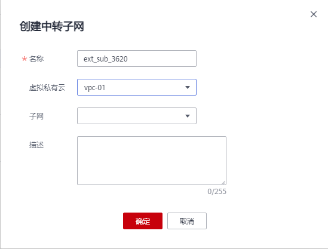

# 创建中转子网和中转IP

## 操作场景

私网NAT网关创建成功后，您需要创建中转子网与中转IP。

通过创建中转子网与中转IP，使虚拟私有云内多个云主机可以共享中转IP访问用户本地数据中心（IDC）或其他虚拟私有云，或面向私网提供服务。

## 前提条件

-   中转VPC创建成功。
-   云专线接入的用户，云专线的虚拟网关中，“VPC网段”参数建议设置为"0.0.0.0/0"。具体配置请参考[创建虚拟网关](https://support.huaweicloud.com/qs-dc/dc_03_0004.html)。

## 操作步骤

1.  登录管理控制台。
2.  在管理控制台左上角单击，选择区域和项目。
3.  在系统首页，单击“网络  \> NAT网关”。

    进入NAT网关页面。

4.  在NAT网关页面，单击“NAT网关\> 私网NAT网关”。
5.  在“中转子网”页签中，单击“创建中转子网”。
6.  根据界面提示，配置中转子网参数，详情请参见[表1](#table12551133922418)。

    **图 1**  创建中转子网  
    

    **表 1**  中转子网参数说明

    
    <table><thead align="left"><tr id="row1654919390247"><th class="cellrowborder" valign="top" width="23.189999999999998%" id="mcps1.2.3.1.1">
<strong id="b65491039102420">参数</strong>

    </th>
    <th class="cellrowborder" valign="top" width="76.81%" id="mcps1.2.3.1.2">
<strong id="b17549153917241">说明</strong>

    </th>
    </tr>
    </thead>
    <tbody><tr id="row165490391243"><td class="cellrowborder" valign="top" width="23.189999999999998%" headers="mcps1.2.3.1.1 ">
名称

    </td>
    <td class="cellrowborder" valign="top" width="76.81%" headers="mcps1.2.3.1.2 ">
中转子网名称。最大支持64个字符，仅支持中文、数字、字母、_（下划线）、-（中划线）。该参数为必填项。

    </td>
    </tr>
    <tr id="row18550939162415"><td class="cellrowborder" valign="top" width="23.189999999999998%" headers="mcps1.2.3.1.1 ">
虚拟私有云

    </td>
    <td class="cellrowborder" valign="top" width="76.81%" headers="mcps1.2.3.1.2 ">
中转子网所属的VPC。该参数为选填项。

    </td>
    </tr>
    <tr id="row1555043972420"><td class="cellrowborder" valign="top" width="23.189999999999998%" headers="mcps1.2.3.1.1 ">
子网

    </td>
    <td class="cellrowborder" valign="top" width="76.81%" headers="mcps1.2.3.1.2 ">
中转子网所在子网。该参数为选填项。

    </td>
    </tr>
    <tr id="row185511439132411"><td class="cellrowborder" valign="top" width="23.189999999999998%" headers="mcps1.2.3.1.1 ">
描述

    </td>
    <td class="cellrowborder" valign="top" width="76.81%" headers="mcps1.2.3.1.2 ">
中转子网信息描述。最大支持255个字符。该参数为选填项。

    </td>
    </tr>
    </tbody>
    </table>

7.  单击“确定”，完成中转子网创建。
8.  单击目标中转子网名称。

    进入中转子网详情页。

9.  单击“创建中转IP”，根据界面提示，配置中转IP参数。

    **图 2**  创建中转IP  
    

    **表 2**  中转IP参数说明

    
    <table><thead align="left"><tr id="row133204479299"><th class="cellrowborder" valign="top" width="23.189999999999998%" id="mcps1.2.3.1.1">
<strong id="b131934742916">参数</strong>

    </th>
    <th class="cellrowborder" valign="top" width="76.81%" id="mcps1.2.3.1.2">
<strong id="b2320124722916">说明</strong>

    </th>
    </tr>
    </thead>
    <tbody><tr id="row532444732915"><td class="cellrowborder" valign="top" width="23.189999999999998%" headers="mcps1.2.3.1.1 ">
分配方式

    </td>
    <td class="cellrowborder" valign="top" width="76.81%" headers="mcps1.2.3.1.2 ">
中转IP的分配方式。

    <ul id="ul15324147122918"><li>自动分配</li><li>手动分配</li></ul>
    </td>
    </tr>
    <tr id="row1132484772914"><td class="cellrowborder" valign="top" width="23.189999999999998%" headers="mcps1.2.3.1.1 ">
IP地址

    </td>
    <td class="cellrowborder" valign="top" width="76.81%" headers="mcps1.2.3.1.2 ">
分配方式为手动分配时，需要填写。此IP地址需包含在中转子网网段内。

    </td>
    </tr>
    </tbody>
    </table>

10. 单击“确定”，完成中转IP创建。

## 相关链接

[管理中转子网](DNAT规则管理-私网NAT网关-38.md)

