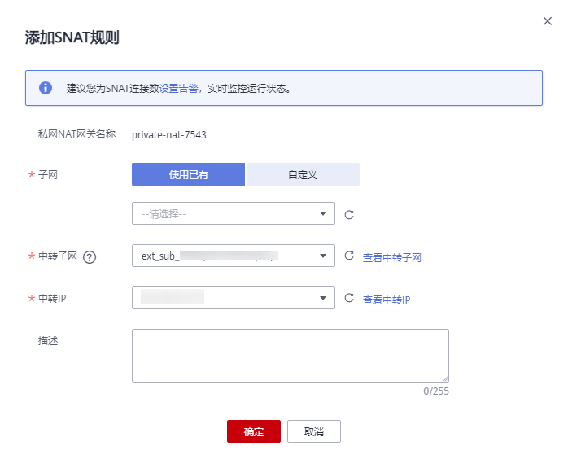

# 添加SNAT规则

## 操作场景

私网NAT网关创建成功后，您需要创建SNAT规则。通过创建SNAT规则，VPC子网中全部或部分云主机可以通过共享中转IP访问用户本地数据中心（IDC）或其他VPC。

一个子网对应一条SNAT规则，如果VPC中有多个子网需要访问用户IDC或其他VPC，则可以通过创建多个SNAT规则实现共享一个或多个中转IP。

## 前提条件

-   私网NAT网关创建成功。
-   中转子网与中转IP创建成功。
-   云专线接入的用户，云专线的虚拟网关中，“VPC网段”参数建议设置为"0.0.0.0/0"。具体配置请参考[创建虚拟网关](https://support.huaweicloud.com/qs-dc/dc_03_0004.html)。

## 操作步骤

1.  登录管理控制台。
2.  在管理控制台左上角单击，选择区域和项目。
3.  在系统首页，单击“网络  \> NAT网关”。

    进入NAT网关页面。

4.  在NAT网关页面，单击“NAT网关\> 私网NAT网关”。

1.  在私网NAT网关页面，单击需要添加SNAT规则的私网NAT网关名称。
2.  在SNAT规则页签中，单击“添加SNAT规则”。
3.  根据界面提示，配置添加SNAT规则参数，详情请参见[表1](#table195455752414)。

    **图 1**  添加SNAT规则  
    

    **表 1**  SNAT规则参数说明

    
    <table><thead align="left"><tr id="row1654227162415"><th class="cellrowborder" valign="top" width="22.400000000000002%" id="mcps1.2.3.1.1">
<strong id="b65421874247">参数</strong>

    </th>
    <th class="cellrowborder" valign="top" width="77.60000000000001%" id="mcps1.2.3.1.2">
<strong id="b14542137102416">说明</strong>

    </th>
    </tr>
    </thead>
    <tbody><tr id="row205431475246"><td class="cellrowborder" valign="top" width="22.400000000000002%" headers="mcps1.2.3.1.1 ">
子网

    </td>
    <td class="cellrowborder" valign="top" width="77.60000000000001%" headers="mcps1.2.3.1.2 ">
云主机访问IDC或其他VPC的方式。

    <ul id="ul054397102411"><li>选择已有：选择虚拟私有云中的子网，使该子网中全部云主机通过SNAT方式访问IDC或其他VPC。</li><li>自定义：选择自定义，使该定义网段中的云主机通过SNAT方式访问IDC或其他VPC。
自定义子网支持配置云专线的IP。

    </li></ul>
    </td>
    </tr>
    <tr id="row1854397202413"><td class="cellrowborder" valign="top" width="22.400000000000002%" headers="mcps1.2.3.1.1 ">
中转子网

    </td>
    <td class="cellrowborder" valign="top" width="77.60000000000001%" headers="mcps1.2.3.1.2 ">
选择中转VPC中创建的中转子网，非当前VPC的中转子网。

    </td>
    </tr>
    <tr id="row1954527192410"><td class="cellrowborder" valign="top" width="22.400000000000002%" headers="mcps1.2.3.1.1 ">
中转IP

    </td>
    <td class="cellrowborder" valign="top" width="77.60000000000001%" headers="mcps1.2.3.1.2 ">
通过该中转IP访问用户IDC或其他VPC。

    
这里只能选择没有被绑定的中转IP，或者被绑定到当前私网NAT网关中SNAT规则上的中转IP。

    </td>
    </tr>
    <tr id="row6545167202420"><td class="cellrowborder" valign="top" width="22.400000000000002%" headers="mcps1.2.3.1.1 ">
描述

    </td>
    <td class="cellrowborder" valign="top" width="77.60000000000001%" headers="mcps1.2.3.1.2 ">
SNAT规则信息描述。最大支持255个字符。

    </td>
    </tr>
    </tbody>
    </table>

4.  配置完成后，单击确定，完成“SNAT规则”创建。

    > **说明：** 
    >根据您的业务需求，可以为一个私网NAT网关添加多条SNAT规则。

## 相关链接

[管理SNAT规则](DNAT规则管理-私网NAT网关-30.md)

