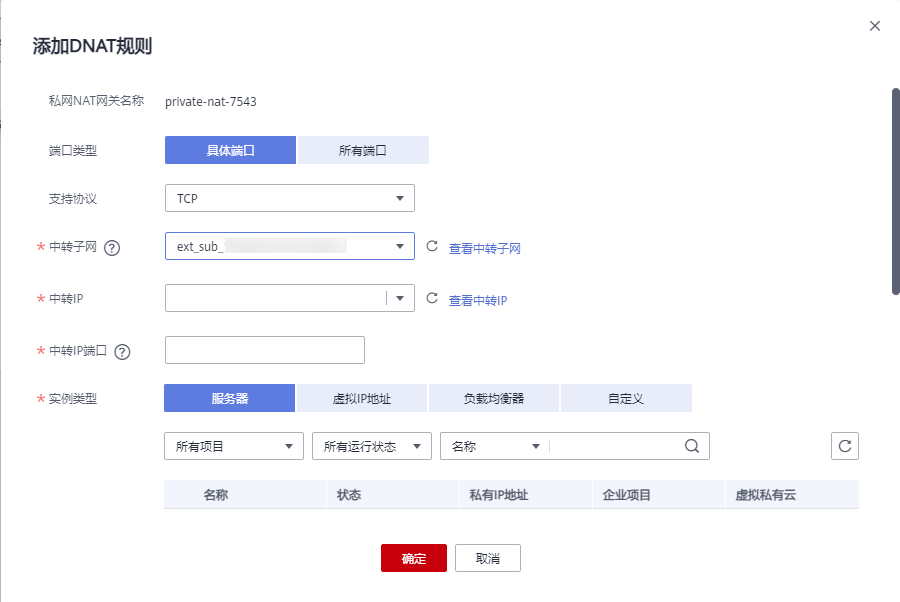

# 添加DNAT规则

## 操作场景

私网NAT网关创建后，通过添加DNAT规则，则可以通过映射方式将您VPC内的云主机实例对外部私网（IDC或其他VPC）提供服务。

云主机的每个端口分别对应一条DNAT规则，一个云主机的多个端口或者多个云主机需要为外部私网提供服务，则需要创建多条DNAT规则。

## 前提条件

-   已成功创建私网NAT网关。
-   中转子网与中转IP创建成功。

## 操作步骤

1.  登录管理控制台。
2.  在管理控制台左上角单击，选择区域和项目。
3.  在系统首页，单击“网络  \> NAT网关”。

    进入NAT网关页面。

4.  在NAT网关页面，单击“NAT网关\> 私网NAT网关”。

1.  在私网NAT网关页面，单击需要添加DNAT规则的私网NAT网关名称。
2.  在私网NAT网关详情页面中，单击“DNAT规则”页签。
3.  在DNAT规则页签中，单击“添加DNAT规则”。

    > **须知：** 
    >配置DNAT规则后，需在目标云主机实例中放通对应的安全组规则，否则DNAT规则不能生效。具体操作步骤，请参见[添加安全组规则](https://support.huaweicloud.com/usermanual-vpc/zh-cn_topic_0030969470.html)。

4.  根据界面提示，配置添加DNAT规则参数，详情请参见[表1](#table149569172358)。

    **图 1**  添加DNAT规则  
    

    **表 1**  DNAT规则参数说明

    
    <table><thead align="left"><tr id="row15953617183514"><th class="cellrowborder" valign="top" width="23.189999999999998%" id="mcps1.2.3.1.1">
<strong id="b1395316175352">参数</strong>

    </th>
    <th class="cellrowborder" valign="top" width="76.81%" id="mcps1.2.3.1.2">
<strong id="b1095310178356">说明</strong>

    </th>
    </tr>
    </thead>
    <tbody><tr id="row1695421713516"><td class="cellrowborder" valign="top" width="23.189999999999998%" headers="mcps1.2.3.1.1 ">
端口类型

    </td>
    <td class="cellrowborder" valign="top" width="76.81%" headers="mcps1.2.3.1.2 ">
分为具体端口和所有端口两种类型。

    <ul id="ul195481716352"><li>具体端口：属于端口映射方式。私网NAT网关会将以指定协议和端口访问该中转IP的请求转发到目标云主机实例的指定端口上。</li><li>所有端口：属于IP映射方式。此方式相当于为云主机配置了一个私网IP（中转IP），任何访问该中转IP的请求都将转发到目标云服务器实例上。</li></ul>
    </td>
    </tr>
    <tr id="row17954121773510"><td class="cellrowborder" valign="top" width="23.189999999999998%" headers="mcps1.2.3.1.1 ">
支持协议

    </td>
    <td class="cellrowborder" valign="top" width="76.81%" headers="mcps1.2.3.1.2 ">
协议类型分为TCP和UDP两种类型。端口类型为所有端口时，此参数默认设置为All。

    
端口类型为具体端口时，可配置此参数。

    </td>
    </tr>
    <tr id="row89541217143512"><td class="cellrowborder" valign="top" width="23.189999999999998%" headers="mcps1.2.3.1.1 ">
中转子网

    </td>
    <td class="cellrowborder" valign="top" width="76.81%" headers="mcps1.2.3.1.2 ">
选择中转VPC中创建的中转子网，非当前VPC的中转子网。

    </td>
    </tr>
    <tr id="row2955171783510"><td class="cellrowborder" valign="top" width="23.189999999999998%" headers="mcps1.2.3.1.1 ">
中转IP

    </td>
    <td class="cellrowborder" valign="top" width="76.81%" headers="mcps1.2.3.1.2 ">
通过该中转IP访问用户IDC或其他VPC。

    
这里只能选择没有被绑定的中转IP，或者被绑定在当前私网NAT网关中非“所有端口”类型DNAT规则上的中转IP。

    </td>
    </tr>
    <tr id="row1395531720352"><td class="cellrowborder" valign="top" width="23.189999999999998%" headers="mcps1.2.3.1.1 ">
中转IP端口

    </td>
    <td class="cellrowborder" valign="top" width="76.81%" headers="mcps1.2.3.1.2 ">
中转IP对外提供服务的端口号。端口范围是1～65535。

    
端口类型为具体端口时，需要配置此参数。

    </td>
    </tr>
    <tr id="row1495521712355"><td class="cellrowborder" valign="top" width="23.189999999999998%" headers="mcps1.2.3.1.1 ">
实例类型

    </td>
    <td class="cellrowborder" valign="top" width="76.81%" headers="mcps1.2.3.1.2 ">
选择对外部私网提供服务的实例类型。

    <ul id="ul595515177355"><li>服务器</li><li>虚拟IP地址</li><li>负载均衡器</li><li>自定义</li></ul>
    </td>
    </tr>
    <tr id="row1295614173357"><td class="cellrowborder" valign="top" width="23.189999999999998%" headers="mcps1.2.3.1.1 ">
网卡

    </td>
    <td class="cellrowborder" valign="top" width="76.81%" headers="mcps1.2.3.1.2 ">
服务器网卡。实例类型为服务器时，需要配置此参数。

    </td>
    </tr>
    <tr id="row13669928395"><td class="cellrowborder" valign="top" width="23.189999999999998%" headers="mcps1.2.3.1.1 ">
IP地址

    </td>
    <td class="cellrowborder" valign="top" width="76.81%" headers="mcps1.2.3.1.2 ">
对外部私网提供服务的云主机IP地址。实例类型为自定义时，需要配置此参数。

    </td>
    </tr>
    <tr id="row19956171783518"><td class="cellrowborder" valign="top" width="23.189999999999998%" headers="mcps1.2.3.1.1 ">
业务端口

    </td>
    <td class="cellrowborder" valign="top" width="76.81%" headers="mcps1.2.3.1.2 ">
实例对外提供服务的协议端口号。端口范围是1～65535。

    
端口类型为具体端口时，需要配置此参数。

    </td>
    </tr>
    <tr id="row14956141773510"><td class="cellrowborder" valign="top" width="23.189999999999998%" headers="mcps1.2.3.1.1 ">
描述

    </td>
    <td class="cellrowborder" valign="top" width="76.81%" headers="mcps1.2.3.1.2 ">
DNAT规则信息描述。最大支持255个字符。

    </td>
    </tr>
    </tbody>
    </table>

5.  配置完成后，单击“确定”，可在DNAT规则列表中查看详情，若“状态”为“运行中”，表示创建成功。

## 相关链接

[管理DNAT规则](DNAT规则管理-私网NAT网关-34.md)

