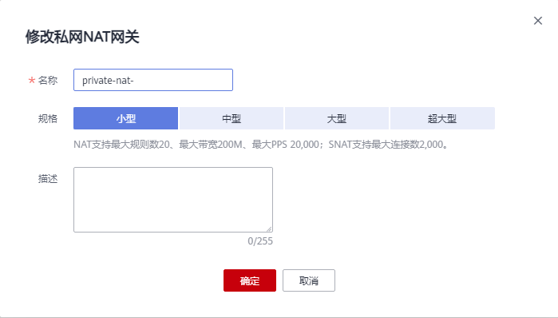

# 修改私网NAT网关

## 操作场景

私网NAT网关创建后，如果您在使用过程中发现当前的NAT网关规格不能满足自己的需求，可以修改私网NAT网关规格、名称和描述。

## 前提条件

私网NAT网关创建成功。

## 操作步骤

1.  登录管理控制台。
2.  在管理控制台左上角单击，选择区域和项目。
3.  在系统首页，单击“网络  \> NAT网关”。

    进入NAT网关页面。

4.  在NAT网关页面，单击“NAT网关\> 私网NAT网关”。

1.  在私网NAT网关页面，单击需要修改的私网NAT网关操作列中的“修改”。
2.  根据界面提示，修改私网NAT网关的名称、规格或者描述等信息。

    **图 1**  修改私网NAT网关  
    

3.  修改完成后，单击“确定”，完成私网NAT网关信息的修改。

    在私网NAT网关列表可以看到修改后的信息。

