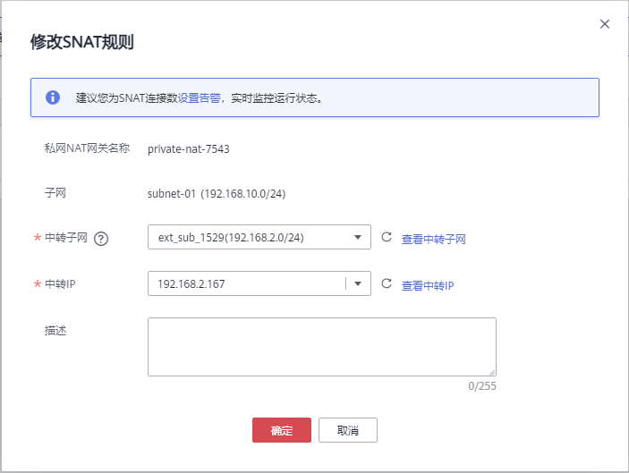

# 修改SNAT规则

## 操作场景

添加SNAT规则后，如果SNAT规则设置有误，或者SNAT规则中的一些参数需要更新时，可以修改SNAT规则。

## 前提条件

私网NAT网关下存在成功添加的SNAT规则。

## 操作步骤

1.  登录管理控制台。
2.  在管理控制台左上角单击，选择区域和项目。
3.  在系统首页，单击“网络  \> NAT网关”。

    进入NAT网关页面。

4.  在NAT网关页面，单击“NAT网关\> 私网NAT网关”。

1.  在私网NAT网关页面，单击目标私网NAT网关的名称。
2.  系统跳转至目标私网NAT网关详情页面，单击“SNAT规则”页签。
3.  在SNAT规则列表中，单击目标私网SNAT规则操作列中的“修改”。
4.  在弹出的对话框中，修改参数中的内容。

    **图 1**  修改SNAT规则  
    

5.  单击“确定”，完成SNAT规则的修改。

