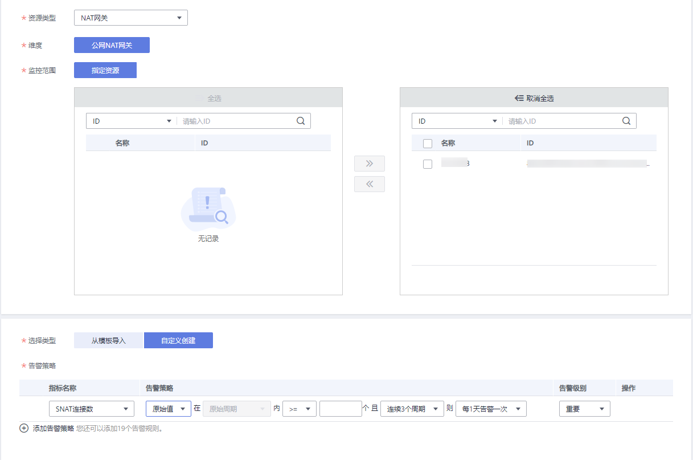

# 创建告警规则

## 操作场景

通过设置NAT网关告警规则，用户可自定义监控目标与通知策略，及时了解NAT网关运行状况，从而起到预警作用。

## 操作步骤

1.  登录管理控制台。
2.  在管理控制台左上角单击，选择区域和项目。
3.  选择“管理与监管 \> 云监控服务”。
4.  在左侧导航树栏，选择“告警 \> 告警规则”。
5.  在“告警规则”界面，单击“创建告警规则”进行添加，或者选择已有的告警规则进行修改，设置NAT网关的告警规则。
6.  在“创建告警规则”界面，根据界面提示配置参数。
    1.  根据界面提示，配置告警规则的基本信息。

        **表 1**  配置规则信息

        
        <table><thead align="left"><tr id="zh-cn_topic_0201532920_row18694135418312"><th class="cellrowborder" valign="top" width="19.21%" id="mcps1.2.3.1.1">
参数

        </th>
        <th class="cellrowborder" valign="top" width="80.78999999999999%" id="mcps1.2.3.1.2">
参数说明

        </th>
        </tr>
        </thead>
        <tbody><tr id="zh-cn_topic_0201532920_row17694105423111"><td class="cellrowborder" valign="top" width="19.21%" headers="mcps1.2.3.1.1 ">
名称

        </td>
        <td class="cellrowborder" valign="top" width="80.78999999999999%" headers="mcps1.2.3.1.2 ">
系统会随机产生一个名称，用户也可以进行修改。

        
取值样例：alarm-b6al

        </td>
        </tr>
        <tr id="zh-cn_topic_0201532920_row13694165413316"><td class="cellrowborder" valign="top" width="19.21%" headers="mcps1.2.3.1.1 ">
描述

        </td>
        <td class="cellrowborder" valign="top" width="80.78999999999999%" headers="mcps1.2.3.1.2 ">
告警规则描述（此参数非必填项）。

        </td>
        </tr>
        <tr id="zh-cn_topic_0201532920_row73291535102612"><td class="cellrowborder" valign="top" width="19.21%" headers="mcps1.2.3.1.1 ">
企业项目

        </td>
        <td class="cellrowborder" valign="top" width="80.78999999999999%" headers="mcps1.2.3.1.2 ">
告警规则所属的企业项目。只有拥有该企业项目权限的用户才可以查看和管理该告警规则。创建企业项目请参考：<a href="https://support.huaweicloud.com/usermanual-em/zh-cn_topic_0108763964.html" target="_blank" rel="noopener noreferrer">创建企业项目</a>。

        </td>
        </tr>
        </tbody>
        </table>

    2.  选择监控对象，配置告警内容参数。

        **图 1**  配置告警内容  
        

        **表 2**  配置告警内容

        
        <table><thead align="left"><tr id="zh-cn_topic_0201532920_row79491995423"><th class="cellrowborder" valign="top" width="14.99%" id="mcps1.2.4.1.1">
参数

        </th>
        <th class="cellrowborder" valign="top" width="63.71%" id="mcps1.2.4.1.2">
参数说明

        </th>
        <th class="cellrowborder" valign="top" width="21.3%" id="mcps1.2.4.1.3">
取值样例

        </th>
        </tr>
        </thead>
        <tbody><tr id="zh-cn_topic_0201532920_row17949393429"><td class="cellrowborder" valign="top" width="14.99%" headers="mcps1.2.4.1.1 ">
资源类型

        </td>
        <td class="cellrowborder" valign="top" width="63.71%" headers="mcps1.2.4.1.2 ">
配置告警规则监控的服务名称。

        </td>
        <td class="cellrowborder" valign="top" width="21.3%" headers="mcps1.2.4.1.3 ">
NAT网关

        </td>
        </tr>
        <tr id="zh-cn_topic_0201532920_row895014917429"><td class="cellrowborder" valign="top" width="14.99%" headers="mcps1.2.4.1.1 ">
维度

        </td>
        <td class="cellrowborder" valign="top" width="63.71%" headers="mcps1.2.4.1.2 ">
用于指定告警规则对应指标的维度名称

        </td>
        <td class="cellrowborder" valign="top" width="21.3%" headers="mcps1.2.4.1.3 ">
公网NAT网关

        </td>
        </tr>
        <tr id="zh-cn_topic_0201532920_row9950199425"><td class="cellrowborder" valign="top" width="14.99%" headers="mcps1.2.4.1.1 ">
监控范围

        </td>
        <td class="cellrowborder" valign="top" width="63.71%" headers="mcps1.2.4.1.2 ">
告警规则适用的资源范围，可选择资源分组或指定资源。

        
 说明： 
<ul id="zh-cn_topic_0201532920_ul895019914215"><li>当选择资源分组时，该分组下任何资源满足告警策略时，都会触发告警通知。</li><li>选择指定资源时，勾选具体的监控对象，单击将监控对象同步到右侧对话框。</li></ul>
        

        </td>
        <td class="cellrowborder" valign="top" width="21.3%" headers="mcps1.2.4.1.3 ">
指定资源

        </td>
        </tr>
        <tr id="zh-cn_topic_0201532920_row5951139154215"><td class="cellrowborder" valign="top" width="14.99%" headers="mcps1.2.4.1.1 ">
选择类型

        </td>
        <td class="cellrowborder" valign="top" width="63.71%" headers="mcps1.2.4.1.2 ">
根据需要可选择从模板导入或自定义创建。

        </td>
        <td class="cellrowborder" valign="top" width="21.3%" headers="mcps1.2.4.1.3 ">
自定义创建

        </td>
        </tr>
        <tr id="zh-cn_topic_0201532920_row1095129204217"><td class="cellrowborder" valign="top" width="14.99%" headers="mcps1.2.4.1.1 ">
模板

        </td>
        <td class="cellrowborder" valign="top" width="63.71%" headers="mcps1.2.4.1.2 ">
选择需要导入的模板。

        
您可以选择系统预置的默认告警模板，或者选择自定义模板。

        </td>
        <td class="cellrowborder" valign="top" width="21.3%" headers="mcps1.2.4.1.3 ">
-

        </td>
        </tr>
        <tr id="zh-cn_topic_0201532920_row89519954220"><td class="cellrowborder" valign="top" width="14.99%" headers="mcps1.2.4.1.1 ">
告警策略

        </td>
        <td class="cellrowborder" valign="top" width="63.71%" headers="mcps1.2.4.1.2 ">
触发告警规则的告警策略。

        
当资源类型选择站点监控、日志监控、自定义监控、具体的云服务时，是否触发告警取决于连续周期的数据是否达到阈值。例如SNAT连接数监控周期为1分钟，连续三个周期原始值≥8000个，则触发告警。

        </td>
        <td class="cellrowborder" valign="top" width="21.3%" headers="mcps1.2.4.1.3 ">
-

        </td>
        </tr>
        <tr id="zh-cn_topic_0201532920_row5951129114220"><td class="cellrowborder" valign="top" width="14.99%" headers="mcps1.2.4.1.1 ">
告警级别

        </td>
        <td class="cellrowborder" valign="top" width="63.71%" headers="mcps1.2.4.1.2 ">
根据告警的严重程度不同等级，可选择紧急、重要、次要、提示。

        </td>
        <td class="cellrowborder" valign="top" width="21.3%" headers="mcps1.2.4.1.3 ">
重要

        </td>
        </tr>
        </tbody>
        </table>

    3.  根据界面提示，配置告警通知参数。

        **图 2**  配置告警通知  
        

        **表 3**  配置告警通知

        
        <table><thead align="left"><tr id="zh-cn_topic_0201532920_row13415173554216"><th class="cellrowborder" valign="top" width="18.87%" id="mcps1.2.3.1.1">
参数

        </th>
        <th class="cellrowborder" valign="top" width="81.13%" id="mcps1.2.3.1.2">
参数说明

        </th>
        </tr>
        </thead>
        <tbody><tr id="zh-cn_topic_0201532920_row3415103514420"><td class="cellrowborder" valign="top" width="18.87%" headers="mcps1.2.3.1.1 ">
发送通知

        </td>
        <td class="cellrowborder" valign="top" width="81.13%" headers="mcps1.2.3.1.2 ">
配置是否发送邮件、短信、HTTP和HTTPS通知用户。

        </td>
        </tr>
        <tr id="zh-cn_topic_0201532920_row42651257134517"><td class="cellrowborder" valign="top" width="18.87%" headers="mcps1.2.3.1.1 ">
通知对象

        </td>
        <td class="cellrowborder" valign="top" width="81.13%" headers="mcps1.2.3.1.2 ">
需要发送告警通知的对象，可选择云账号联系人或主题名称。

        <ul id="zh-cn_topic_0201532920_ul15465311191116"><li>云账号联系人为注册账号时的手机和邮箱。</li><li>主题是消息发布或客户端订阅通知的特定事件类型，若此处没有需要的主题则需先创建主题并添加订阅，创建主题并添加订阅请参见<a href="https://support.huaweicloud.com/usermanual-ces/ces_01_0069.html" target="_blank" rel="noopener noreferrer">《云监控用户指南》</a>。</li></ul>
        </td>
        </tr>
        <tr id="zh-cn_topic_0201532920_row18415153564213"><td class="cellrowborder" valign="top" width="18.87%" headers="mcps1.2.3.1.1 ">
生效时间

        </td>
        <td class="cellrowborder" valign="top" width="81.13%" headers="mcps1.2.3.1.2 ">
该告警规则仅在生效时间内发送通知消息。

        
如生效时间为08:00-20:00，则该告警规则仅在08:00-20:00发送通知消息。

        </td>
        </tr>
        <tr id="zh-cn_topic_0201532920_row1416153504210"><td class="cellrowborder" valign="top" width="18.87%" headers="mcps1.2.3.1.1 ">
触发条件

        </td>
        <td class="cellrowborder" valign="top" width="81.13%" headers="mcps1.2.3.1.2 ">
可以选择“出现告警”、“恢复正常”两种状态，作为触发告警通知的条件。

        </td>
        </tr>
        </tbody>
        </table>

7.  规则参数设置完成后，单击“立即创建”。

    NAT网关告警规则设置完成后，当符合规则的告警产生时，系统会自动进行通知。

> **说明：** 
>更多关于设置告警规则的信息，请参见[《云监控用户指南》](https://support.huaweicloud.com/usermanual-ces/ces_01_0073.html)。

