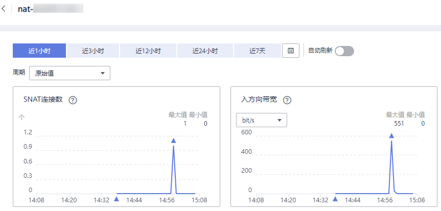
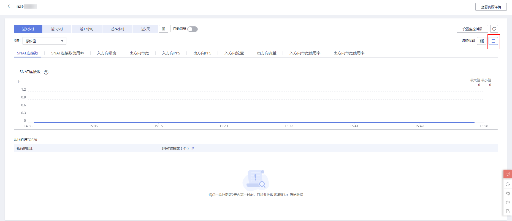

# 查看监控指标

## 前提条件

-   NAT网关正常运行，并且已经创建SNAT规则。
-   由于监控数据的获取与传输会花费一定时间，因此，请等待一段时间后再查看监控数据。

## 操作场景

查看NAT网关的监控指标详情。

## 操作步骤

1.  登录管理控制台。
2.  在左上角中的切换区域下拉列框中，选择目标区域。
3.  选择“管理与监管 \> 云监控服务”。
4.  单击页面左侧的“云服务监控”，选择“NAT网关”。
5.  单击“操作”列的“查看监控指标”，查看NAT网关的监控指标详情。

    支持查看“近1小时”、“近3小时”、“近12小时”、“近24小时”和“近7天”的数据。

    **图 1**  查看监控指标  
    

6.  （可选）在NAT网关监控指标详情页右上角，单击图标，切换视图为详情图，查看各监控指标TOP20的云主机IP。

    **图 2**  查看各监控指标TOP20的云主机IP  
    

