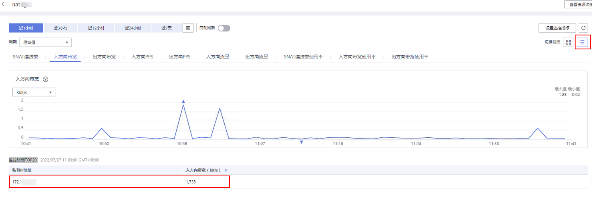

# 查看NAT网关后端实例对应的监控指标

## 操作场景

如果您需要查看特定NAT网关的某个监控指标下各个后端实例对应的该监控指标情况，您可以按照如下步骤操作。

## 操作步骤

1.  登录管理控制台。
2.  在管理控制台左上角单击，选择区域和项目。
3.  在系统首页，单击“网络 \> NAT网关”。

    进入NAT网关页面。

4.  在NAT网关页面，单击需要查看监控指标的NAT网关名称。
5.  切换至“监控”页签，单击页面中间的“查看更多指标详情”。

    进入云监控服务的查看NAT网关监控指标页面。

6.  选择所需查看的监控指标时间段。
7.  单击页面右上角的切换视图图标，来切换各个监控指标展示的方式。
8.  选择所需查看的监控指标并在显示的监控指标图中选择某一时间点。

    在页面下方就可以查看到NAT网关后端实例对应的该监控指标情况。

    **图 1**  查看NAT网关后端实例对应的监控指标  
    

