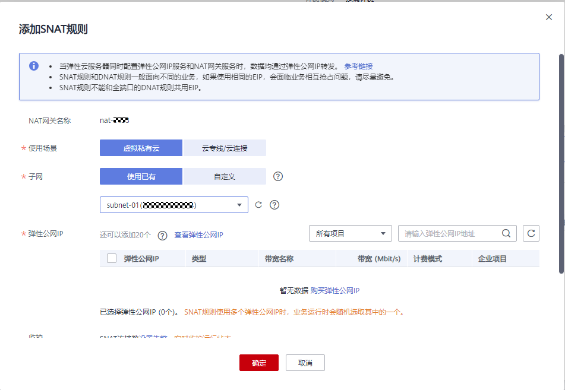

# 添加SNAT规则

## 操作场景

公网NAT网关创建成功后，您需要创建SNAT规则。通过创建SNAT规则，虚拟私有云子网中全部或部分云主机可以通过共享弹性公网IP访问公网，或云专线/云连接用户侧端该网段下的服务器可以通过共享弹性公网IP访问公网。

一个子网对应一条SNAT规则，如果VPC中有多个子网需要访问公网，则可以通过创建多个SNAT规则实现共享一个或多个弹性公网IP资源。

## 前提条件

-   公网NAT网关创建成功。
-   云专线接入的用户，云专线的虚拟网关中，“VPC网段”参数建议设置为"0.0.0.0/0"。具体配置请参考[创建虚拟网关](https://support.huaweicloud.com/qs-dc/dc_03_0004.html)。

## 操作步骤

1.  登录管理控制台。
2.  在管理控制台左上角单击图标，选择区域和项目。
3.  在系统首页，单击“网络 \> NAT网关”。

    进入公网NAT网关页面。

4.  在公网NAT网关页面，单击需要添加SNAT规则的公网NAT网关名称。
5.  在SNAT规则页签中，单击“添加SNAT规则”。

    **图 1**  添加SNAT规则  
    

6.  根据界面提示，配置添加SNAT规则参数，详情请参见[表1](#zh-cn_topic_0127293981_table4272024117597)。

    **表 1**  SNAT规则参数说明

    
    <table><thead align="left"><tr id="zh-cn_topic_0127293981_row3248015417597"><th class="cellrowborder" valign="top" width="26.0674482558981%" id="mcps1.2.3.1.1">
<strong id="zh-cn_topic_0127293981_b24166891144739">参数</strong>

    </th>
    <th class="cellrowborder" valign="top" width="73.93255174410189%" id="mcps1.2.3.1.2">
<strong id="zh-cn_topic_0127293981_b1365228517597">说明</strong>

    </th>
    </tr>
    </thead>
    <tbody><tr id="zh-cn_topic_0127293981_row144002379410"><td class="cellrowborder" valign="top" width="26.0674482558981%" headers="mcps1.2.3.1.1 ">
使用场景

    </td>
    <td class="cellrowborder" valign="top" width="73.93255174410189%" headers="mcps1.2.3.1.2 ">
SNAT规则使用的场景。

    
当虚拟私有云中的云主机需要访问公网时，选择虚拟私有云。

    
当云专线/VPN本地数据中心端的服务器需要访问公网时，选择云专线/云连接。

    </td>
    </tr>
    <tr id="zh-cn_topic_0127293981_row3209331417597"><td class="cellrowborder" valign="top" width="26.0674482558981%" headers="mcps1.2.3.1.1 ">
子网

    </td>
    <td class="cellrowborder" valign="top" width="73.93255174410189%" headers="mcps1.2.3.1.2 "><ul id="ul1779741412317"><li>使用已有：选择现有子网，使云服务器通过SNAT方式访问公网。</li><li>自定义：自定义一个网段或者填写某个主机地址，使云服务器通过SNAT方式访问公网。
 说明： 

支持配置0.0.0.0/0的地址段，在多段地址配置时更方便。

    
可以配置32位主机地址，NAT网关只针对此地址起作用。

    

    </li></ul>
    </td>
    </tr>
    <tr id="zh-cn_topic_0127293981_row5801532217597"><td class="cellrowborder" valign="top" width="26.0674482558981%" headers="mcps1.2.3.1.1 ">
弹性公网IP

    </td>
    <td class="cellrowborder" valign="top" width="73.93255174410189%" headers="mcps1.2.3.1.2 ">
用来提供互联网访问的公网IP。

    
这里只能选择没有被绑定的弹性公网IP，或者被绑定在当前公网NAT网关中非“所有端口”类型DNAT规则上的弹性公网IP，或者被绑定到当前公网NAT网关中SNAT规则上的弹性公网IP。

    
可选择多条EIP添加在SNAT规则中。一条SNAT规则最多添加20个EIP。SNAT规则使用多个EIP时，业务运行时会随机选取其中的一个。

    </td>
    </tr>
    <tr id="row182413199575"><td class="cellrowborder" valign="top" width="26.0674482558981%" headers="mcps1.2.3.1.1 ">
监控

    </td>
    <td class="cellrowborder" valign="top" width="73.93255174410189%" headers="mcps1.2.3.1.2 ">
为SNAT连接数设置告警。

    
可通过设置告警及时了解SNAT连接数运行状况，从而起到预警作用。

    </td>
    </tr>
    <tr id="row153111641748"><td class="cellrowborder" valign="top" width="26.0674482558981%" headers="mcps1.2.3.1.1 ">
描述

    </td>
    <td class="cellrowborder" valign="top" width="73.93255174410189%" headers="mcps1.2.3.1.2 ">
SNAT规则信息描述。最大支持255个字符。

    </td>
    </tr>
    </tbody>
    </table>

7.  配置完成后，单击确定，完成“SNAT规则”创建。

    > **说明：** 
    >-   根据您的业务需求，可以为一个公网NAT网关添加多条SNAT规则。
    >-   一个VPC支持关联多个公网NAT网关。
    >-   VPC内的每个子网只能添加一条SNAT规则。

