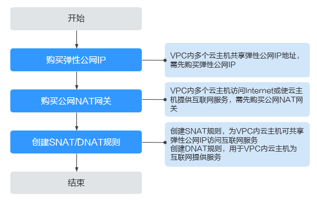

# 公网NAT网关简介

公网NAT网关（Public NAT Gateway）能够为虚拟私有云内的云主机（弹性云服务器云主机、裸金属服务器物理机）或者通过云专线/VPN接入虚拟私有云的本地数据中心的服务器，提供最高20Gbit/s能力的网络地址转换服务，使多个云主机可以共享弹性公网IP访问Internet或使云主机提供互联网服务。

> **说明：** 
>私网NAT网关目前在“华北-北京四”、“华东-上海一”、“华南-广州”、“西南-贵阳一”、“中国-香港”、“亚太-新加坡”、“亚太-曼谷”、“非洲-约翰内斯堡”、“拉美-圣保罗一”区域公测中。

公网NAT网关使用流程如下：

**图 1**  公网NAT使用流程  

