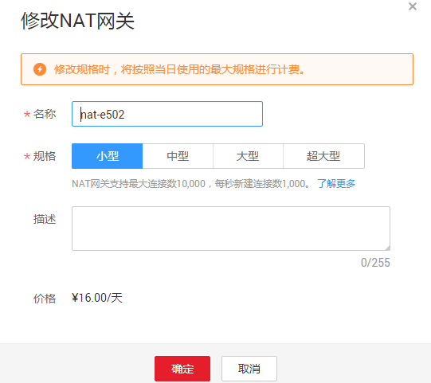

# 修改NAT网关

## 操作场景

NAT网关创建后，如果您在使用过程中发现当前的NAT网关规格不能满足自己的需求，可以修改NAT网关规格、名称和描述。

## 操作前提

NAT网关创建成功。

## 操作步骤

1.  登录管理控制台。
2.  在管理控制台左上角单击，选择区域和项目。
3.  在系统首页，单击“网络 \> NAT网关”。
4.  在NAT网关页面，单击需要修改的NAT网关操作列中的“修改”。
5.  根据界面提示，修改NAT网关的名称、规格或者描述等信息。

    **图 1**  修改NAT网关  
    

6.  修改完成后，单击“确认”，完成NAT网关信息的修改，在NAT网关列表可以看到修改后的信息。

