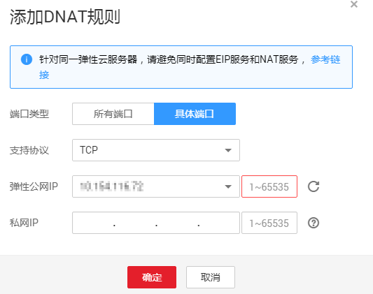

# 添加DNAT规则

## 操作场景

NAT网关创建后，通过添加DNAT规则，则可以通过映射方式将您VPC内的云主机对互联网提供服务。

一个云主机绑定一条DNAT规则，如果您有多个云主机需要为互联网提供服务，则需要创建多条DNAT规则。

## 操作前提

已成功创建NAT网关。

## 操作步骤

1.  登录管理控制台。
2.  在管理控制台左上角单击图标，选择区域和项目。
3.  在系统首页，单击“网络\>NAT网关”。
4.  在NAT网关页面，单击需要添加DNAT规则的NAT网关名称。
5.  在NAT网关详情页面中，单击“DNAT规则”页签。
6.  在SNAT规则页签中，单击“添加DNAT规则”。

    **图 1**  添加DNAT规则  
    

7.  根据界面提示，配置添加DNAT规则参数，详情请参见[表1](#zh-cn_topic_0127293986_table30787259144637)。

    **表 1**  DNAT规则参数说明

    
    <table><thead align="left"><tr id="zh-cn_topic_0127293986_row1287982144637"><th class="cellrowborder" valign="top" width="25%" id="mcps1.2.3.1.1">
<strong id="zh-cn_topic_0127293986_b64475021144748">参数</strong>

    </th>
    <th class="cellrowborder" valign="top" width="75%" id="mcps1.2.3.1.2">
<strong id="zh-cn_topic_0127293986_b37983896144751">说明</strong>

    </th>
    </tr>
    </thead>
    <tbody><tr id="zh-cn_topic_0127293986_row1895714384610"><td class="cellrowborder" valign="top" width="25%" headers="mcps1.2.3.1.1 ">
端口类型

    </td>
    <td class="cellrowborder" valign="top" width="75%" headers="mcps1.2.3.1.2 ">
分为所有端口和具体端口两种类型。

    
所有端口：属于IP映射方式。此方式相当于为弹性云服务器配置了一个弹性公网IP，任何访问该弹性公网IP的请求都将转发到目标弹性云服务器实例上。

    
具体端口：属于端口映射方式。NAT网关会将以指定协议和端口访问该弹性公网IP的请求转发到目标弹性云服务器实例的指定端口上。

    </td>
    </tr>
    <tr id="zh-cn_topic_0127293986_row13591056167"><td class="cellrowborder" valign="top" width="25%" headers="mcps1.2.3.1.1 ">
支持协议

    </td>
    <td class="cellrowborder" valign="top" width="75%" headers="mcps1.2.3.1.2 ">
协议类型分为TCP和UDP两种类型。端口类型为具体端口时，可配置此参数，端口类型为所有端口时，此参数默认设置为ANY。

    </td>
    </tr>
    <tr id="zh-cn_topic_0127293986_row43238809144637"><td class="cellrowborder" valign="top" width="25%" headers="mcps1.2.3.1.1 ">
弹性公网IP

    </td>
    <td class="cellrowborder" valign="top" width="75%" headers="mcps1.2.3.1.2 ">
弹性IP地址及公网端口。

    
只能使用未绑定的弹性公网IP或者被绑定在当前VPC中DNAT规则上的弹性公网IP。

    </td>
    </tr>
    <tr id="zh-cn_topic_0127293986_row35593477144637"><td class="cellrowborder" valign="top" width="25%" headers="mcps1.2.3.1.1 ">
私网IP

    </td>
    <td class="cellrowborder" valign="top" width="75%" headers="mcps1.2.3.1.2 ">
弹性云服务器的IP地址或者用户的私有IP地址。端口类型为具体端口时，需要配置私网IP的端口。

    </td>
    </tr>
    </tbody>
    </table>

8.  配置完成后，单击“确定”，可在DNAT规则列表中查看详情，若“状态”为“运行中”，表示创建成功。

