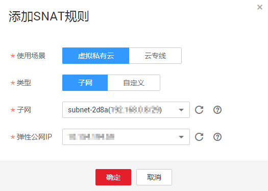

# 添加SNAT规则

## 操作场景

NAT网关创建成功后，您需要创建SNAT规则。通过创建SNAT规则，您可以将弹性公网IP和子网配置到SNAT规则中，该子网下的云主机可以通过弹性公网IP访问互联网。

一个子网对应一条SNAT规则，如果VPC中有多个子网需要访问公网，则可以通过创建多个SNAT规则实现共享一个或多个弹性公网IP资源。

## 操作前提

-   NAT网关创建成功。
-   云专线接入的用户，需要在云专线侧配置目的为0.0.0.0/0的路由，同时本端VPC侧需要配置Local网段为0.0.0.0/0。

## 操作步骤

1.  登录管理控制台
2.  在管理控制台左上角单击图标，选择区域和项目。
3.  在系统首页，单击“网络\>NAT网关”。
4.  在NAT网关页面，单击需要添加SNAT规则的NAT网关名称。
5.  在SNAT规则页签中，单击“添加SNAT规则”。

    **图 1**  添加SNAT规则  
    

6.  根据界面提示，配置添加SNAT规则参数，详情请参见[表1](#zh-cn_topic_0127293981_table4272024117597)。

    **表 1**  SNAT规则参数说明

    
    <table><thead align="left"><tr id="zh-cn_topic_0127293981_row3248015417597"><th class="cellrowborder" valign="top" width="39%" id="mcps1.2.3.1.1">
<strong id="zh-cn_topic_0127293981_b24166891144739">参数</strong>

    </th>
    <th class="cellrowborder" valign="top" width="61%" id="mcps1.2.3.1.2">
<strong id="zh-cn_topic_0127293981_b1365228517597">说明</strong>

    </th>
    </tr>
    </thead>
    <tbody><tr id="zh-cn_topic_0127293981_row144002379410"><td class="cellrowborder" valign="top" width="39%" headers="mcps1.2.3.1.1 ">
使用场景

    </td>
    <td class="cellrowborder" valign="top" width="61%" headers="mcps1.2.3.1.2 ">
需要配置SNAT规则云主机的场景。

    
虚拟私有云：为虚拟私有云中的云主机配置SNAT规则。

    
云专线：为通过云专线/VPN接入虚拟私有云的服务器配置SNAT规则。

    </td>
    </tr>
    <tr id="zh-cn_topic_0127293981_row5681056546"><td class="cellrowborder" valign="top" width="39%" headers="mcps1.2.3.1.1 ">
类型

    </td>
    <td class="cellrowborder" valign="top" width="61%" headers="mcps1.2.3.1.2 ">
云主机访问公网的方式。

    
分为子网和自定义两种方式

    </td>
    </tr>
    <tr id="zh-cn_topic_0127293981_row3209331417597"><td class="cellrowborder" valign="top" width="39%" headers="mcps1.2.3.1.1 ">
子网

    </td>
    <td class="cellrowborder" valign="top" width="61%" headers="mcps1.2.3.1.2 ">
通过配置SNAT规则，实现访问互联网的子网。

    </td>
    </tr>
    <tr id="zh-cn_topic_0127293981_row5801532217597"><td class="cellrowborder" valign="top" width="39%" headers="mcps1.2.3.1.1 ">
弹性公网IP

    </td>
    <td class="cellrowborder" valign="top" width="61%" headers="mcps1.2.3.1.2 ">
用来提供互联网访问的公网IP。

    
这里需要选择未绑定到弹性云服务器或其它NAT网关的弹性IP。

    </td>
    </tr>
    <tr id="zh-cn_topic_0127293981_row1979120341918"><td class="cellrowborder" valign="top" width="39%" headers="mcps1.2.3.1.1 ">
网段

    </td>
    <td class="cellrowborder" valign="top" width="61%" headers="mcps1.2.3.1.2 ">
此参数在虚拟私有云场景中，可作为自定义的云主机网段使用；

    
云专线场景中，作为专线对端的服务器网段使用。

    </td>
    </tr>
    </tbody>
    </table>

7.  配置完成后，单击确定，完成“SNAT规则”创建。

    > **说明：**   
    >根据您的业务需求，可以为一个NAT网关添加多条SNAT规则。  

