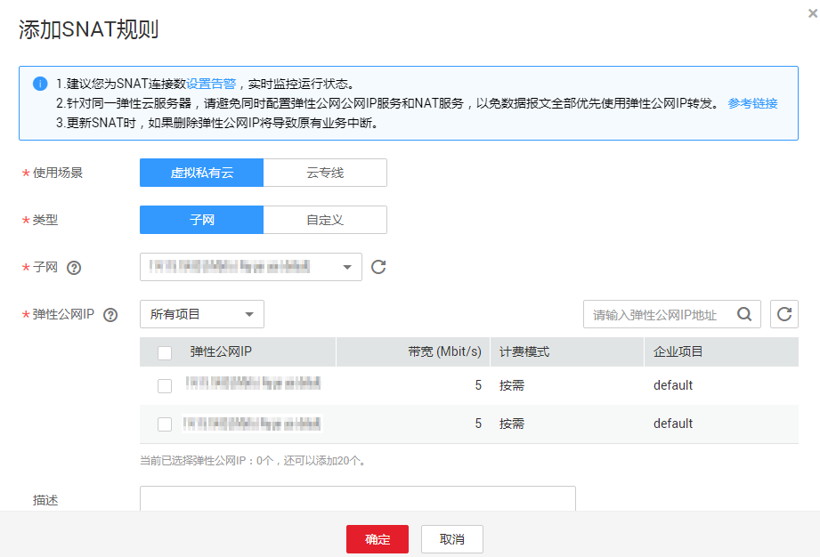

# 添加SNAT规则

## 操作场景

NAT网关创建成功后，您需要创建SNAT规则。通过创建SNAT规则，虚拟私有云子网中全部或部分云主机可以通过共享弹性公网IP访问公网，或云专线/VPN用户侧端该网段下的服务器可以通过共享弹性公网IP访问公网。

一个子网对应一条SNAT规则，如果VPC中有多个子网需要访问公网，则可以通过创建多个SNAT规则实现共享一个或多个弹性公网IP资源。

## 前提条件

-   NAT网关创建成功。
-   云专线接入的用户，云专线的虚拟网关中，“VPC网段”参数建议设置为"0.0.0.0/0"。具体配置请参考[创建虚拟网关](https://support.huaweicloud.com/qs-dc/zh-cn_topic_0110437384.html)。

## 操作步骤

1.  登录管理控制台
2.  在管理控制台左上角单击图标，选择区域和项目。
3.  在系统首页，单击“网络 \> NAT网关”。
4.  在NAT网关页面，单击需要添加SNAT规则的NAT网关名称。
5.  在SNAT规则页签中，单击“添加SNAT规则”。

    **图 1**  添加SNAT规则  
    

6.  根据界面提示，配置添加SNAT规则参数，详情请参见[表1](#zh-cn_topic_0127293981_table4272024117597)。

    **表 1**  SNAT规则参数说明

    
    <table><thead align="left"><tr id="zh-cn_topic_0127293981_row3248015417597"><th class="cellrowborder" valign="top" width="17.96%" id="mcps1.2.4.1.1">
<strong id="zh-cn_topic_0127293981_b24166891144739">参数</strong>

    </th>
    <th class="cellrowborder" valign="top" width="30.959999999999997%" id="mcps1.2.4.1.2">
场景条件

    </th>
    <th class="cellrowborder" valign="top" width="51.080000000000005%" id="mcps1.2.4.1.3">
<strong id="zh-cn_topic_0127293981_b1365228517597">说明</strong>

    </th>
    </tr>
    </thead>
    <tbody><tr id="zh-cn_topic_0127293981_row144002379410"><td class="cellrowborder" valign="top" width="17.96%" headers="mcps1.2.4.1.1 ">
使用场景

    </td>
    <td class="cellrowborder" valign="top" width="30.959999999999997%" headers="mcps1.2.4.1.2 ">
N/A

    </td>
    <td class="cellrowborder" valign="top" width="51.080000000000005%" headers="mcps1.2.4.1.3 ">
SNAT规则使用的场景。

    
当虚拟私有云中的云主机需要访问公网时，选择虚拟私有云。

    
当云专线/VPN本地数据中心端的服务器需要访问公网时，选择云专线。

    </td>
    </tr>
    <tr id="zh-cn_topic_0127293981_row5681056546"><td class="cellrowborder" valign="top" width="17.96%" headers="mcps1.2.4.1.1 ">
类型

    </td>
    <td class="cellrowborder" valign="top" width="30.959999999999997%" headers="mcps1.2.4.1.2 ">
当使用场景为虚拟私有云时，需要配置此参数。

    </td>
    <td class="cellrowborder" valign="top" width="51.080000000000005%" headers="mcps1.2.4.1.3 ">
云主机访问公网的方式。

    
当虚拟私有云子网中的全部云主机需要通过SNAT方式访问公网时，选择子网，使该子网中的云主机通过SNAT方式访问公网。

    
当虚拟私有云子网中的部分云主机需要通过SNAT方式访问公网时，选择自定义，使该网段中的云主机通过SNAT方式访问公网。

    </td>
    </tr>
    <tr id="zh-cn_topic_0127293981_row3209331417597"><td class="cellrowborder" valign="top" width="17.96%" headers="mcps1.2.4.1.1 ">
子网

    </td>
    <td class="cellrowborder" valign="top" width="30.959999999999997%" headers="mcps1.2.4.1.2 ">
当使用场景为虚拟私有云，类型为子网时，需要配置此参数。

    </td>
    <td class="cellrowborder" valign="top" width="51.080000000000005%" headers="mcps1.2.4.1.3 ">
选择虚拟私有云中的子网，可实现该子网中的云主机通过SNAT的方式访问公网。

    </td>
    </tr>
    <tr id="zh-cn_topic_0127293981_row5801532217597"><td class="cellrowborder" valign="top" width="17.96%" headers="mcps1.2.4.1.1 ">
弹性公网IP

    </td>
    <td class="cellrowborder" valign="top" width="30.959999999999997%" headers="mcps1.2.4.1.2 "><ul id="ul12621049122212"><li>类型为虚拟私有云时需要配置此参数。</li><li>类型为云专线时需要配置此参数。</li></ul>
    </td>
    <td class="cellrowborder" valign="top" width="51.080000000000005%" headers="mcps1.2.4.1.3 ">
用来提供互联网访问的公网IP。

    
这里只能选择没有被绑定的弹性公网IP，或者被绑定在当前NAT网关中非“所有端口”类型DNAT规则上的弹性公网IP，或者被绑定到当前NAT网关中SNAT规则上的弹性公网IP。

    </td>
    </tr>
    <tr id="zh-cn_topic_0127293981_row1979120341918"><td class="cellrowborder" valign="top" width="17.96%" headers="mcps1.2.4.1.1 ">
网段

    </td>
    <td class="cellrowborder" valign="top" width="30.959999999999997%" headers="mcps1.2.4.1.2 "><ul id="ul667124915224"><li>使用场景为虚拟私有云，类型为自定义时需要配置此参数。</li><li>使用场景为云专线时，需要配置此参数。</li></ul>
    </td>
    <td class="cellrowborder" valign="top" width="51.080000000000005%" headers="mcps1.2.4.1.3 ">
使用场景为虚拟私有云时，通过配置虚拟私有云子网中的某个网段，使该网段中的云主机通过SNAT方式访问公网。

    
使用场景为云专线时，通过配置云专线/VPN 本地数据中心的某个网段，使该网段中的服务器通过SNAT方式访问公网。

    </td>
    </tr>
    <tr id="row153111641748"><td class="cellrowborder" valign="top" width="17.96%" headers="mcps1.2.4.1.1 ">
描述

    </td>
    <td class="cellrowborder" valign="top" width="30.959999999999997%" headers="mcps1.2.4.1.2 ">
N/A

    </td>
    <td class="cellrowborder" valign="top" width="51.080000000000005%" headers="mcps1.2.4.1.3 ">
NAT网关信息描述。最大支持255个字符。

    </td>
    </tr>
    </tbody>
    </table>

7.  配置完成后，单击确定，完成“SNAT规则”创建。

    > **说明：**   
    >根据您的业务需求，可以为一个NAT网关添加多条SNAT规则。  

