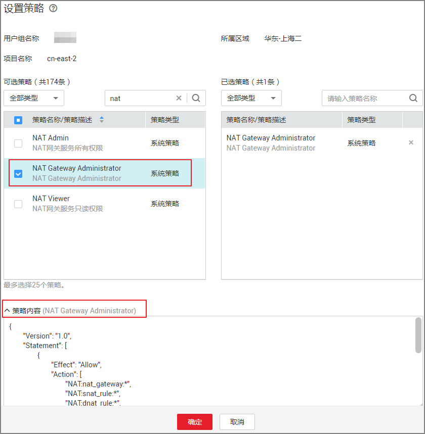

# 策略语法：RBAC<a name="zh-cn_topic_201905307"></a>

策略结构包括：策略版本号（Version）、策略授权语句（Statement）和策略依赖（Depends）。

**图 1**  策略结构<a name="zh-cn_topic_0171158983_fig1397664112403"></a>  


## 策略语法<a name="zh-cn_topic_0171158983_section186518419401"></a>

如下以NAT网关服务的“NAT Gateway Administrator”为例，说明RBAC策略语法



```
{
        "Version": "1.0",
        "Statement": [
                {
                        "Effect": "Allow",
                        "Action": [
                                "NAT:nat_gateway:*",
                                "NAT:snat_rule:*",
                                "NAT:dnat_rule:*",
                                "VPC:router:*",
                                "VPC:port:*",
                                "VPC:floatingip:*"
                        ]
                }
        ],
        "Depends": [
                {
                        "catalog": "BASE",
                        "display_name": "Tenant Guest"
                }
        ]
}
```

**表 1**  参数说明

<a name="zh-cn_topic_0171158983_table686894111405"></a>
<table><thead align="left"><tr id="zh-cn_topic_0171158983_row8977194116407"><th class="cellrowborder" colspan="2" valign="top" id="mcps1.2.5.1.1"><p id="zh-cn_topic_0171158983_p39781241114018"><a name="zh-cn_topic_0171158983_p39781241114018"></a><a name="zh-cn_topic_0171158983_p39781241114018"></a>参数</p>
</th>
<th class="cellrowborder" valign="top" id="mcps1.2.5.1.2"><p id="zh-cn_topic_0171158983_p1297854111403"><a name="zh-cn_topic_0171158983_p1297854111403"></a><a name="zh-cn_topic_0171158983_p1297854111403"></a>含义</p>
</th>
<th class="cellrowborder" valign="top" id="mcps1.2.5.1.3"><p id="zh-cn_topic_0171158983_p1997820417408"><a name="zh-cn_topic_0171158983_p1997820417408"></a><a name="zh-cn_topic_0171158983_p1997820417408"></a>值</p>
</th>
</tr>
</thead>
<tbody><tr id="zh-cn_topic_0171158983_row2978204118404"><td class="cellrowborder" colspan="2" valign="top" headers="mcps1.2.5.1.1 "><p id="zh-cn_topic_0171158983_p169788418405"><a name="zh-cn_topic_0171158983_p169788418405"></a><a name="zh-cn_topic_0171158983_p169788418405"></a>Version</p>
</td>
<td class="cellrowborder" valign="top" headers="mcps1.2.5.1.2 "><p id="zh-cn_topic_0171158983_p0978154118407"><a name="zh-cn_topic_0171158983_p0978154118407"></a><a name="zh-cn_topic_0171158983_p0978154118407"></a>策略的版本</p>
</td>
<td class="cellrowborder" valign="top" headers="mcps1.2.5.1.3 "><p id="zh-cn_topic_0171158983_p18978041204015"><a name="zh-cn_topic_0171158983_p18978041204015"></a><a name="zh-cn_topic_0171158983_p18978041204015"></a>固定为“1.0”</p>
</td>
</tr>
<tr id="zh-cn_topic_0171158983_row19978194174010"><td class="cellrowborder" rowspan="2" valign="top" width="17.17171717171717%" headers="mcps1.2.5.1.1 "><p id="zh-cn_topic_0171158983_p2978134194016"><a name="zh-cn_topic_0171158983_p2978134194016"></a><a name="zh-cn_topic_0171158983_p2978134194016"></a>Statement</p>
</td>
<td class="cellrowborder" valign="top" width="17.17171717171717%" headers="mcps1.2.5.1.1 "><p id="zh-cn_topic_0171158983_p5978241124017"><a name="zh-cn_topic_0171158983_p5978241124017"></a><a name="zh-cn_topic_0171158983_p5978241124017"></a>Action</p>
</td>
<td class="cellrowborder" valign="top" width="28.28282828282828%" headers="mcps1.2.5.1.2 "><p id="zh-cn_topic_0171158983_p197884124015"><a name="zh-cn_topic_0171158983_p197884124015"></a><a name="zh-cn_topic_0171158983_p197884124015"></a>定义对NAT网关的具体操作。</p>
</td>
<td class="cellrowborder" valign="top" width="37.37373737373737%" headers="mcps1.2.5.1.3 "><p id="zh-cn_topic_0171158983_p1697818417400"><a name="zh-cn_topic_0171158983_p1697818417400"></a><a name="zh-cn_topic_0171158983_p1697818417400"></a>格式为：服务名:资源类型:操作</p>
<p id="p10326173118250"><a name="p10326173118250"></a><a name="p10326173118250"></a>"NAT:*:*"，表示对NAT网关的所有操作，其中NAT为服务名称；“*”为通配符，表示对所有的资源类型可以执行所有操作。</p>
</td>
</tr>
<tr id="zh-cn_topic_0171158983_row397894115403"><td class="cellrowborder" valign="top" headers="mcps1.2.5.1.1 "><p id="zh-cn_topic_0171158983_p12978194117405"><a name="zh-cn_topic_0171158983_p12978194117405"></a><a name="zh-cn_topic_0171158983_p12978194117405"></a>Effect</p>
</td>
<td class="cellrowborder" valign="top" headers="mcps1.2.5.1.1 "><p id="zh-cn_topic_0171158983_p1497864111402"><a name="zh-cn_topic_0171158983_p1497864111402"></a><a name="zh-cn_topic_0171158983_p1497864111402"></a>定义Action中所包含的具体操作是否允许执行。</p>
</td>
<td class="cellrowborder" valign="top" headers="mcps1.2.5.1.2 "><a name="zh-cn_topic_0171158983_ul2978204144018"></a><a name="zh-cn_topic_0171158983_ul2978204144018"></a><ul id="zh-cn_topic_0171158983_ul2978204144018"><li>Allow：允许执行。</li><li>Deny：不允许执行。</li></ul>
</td>
</tr>
<tr id="zh-cn_topic_0171158983_row8979114154018"><td class="cellrowborder" rowspan="2" valign="top" width="17.17171717171717%" headers="mcps1.2.5.1.1 "><p id="zh-cn_topic_0171158983_p1597964154011"><a name="zh-cn_topic_0171158983_p1597964154011"></a><a name="zh-cn_topic_0171158983_p1597964154011"></a>Depends</p>
</td>
<td class="cellrowborder" valign="top" width="17.17171717171717%" headers="mcps1.2.5.1.1 "><p id="zh-cn_topic_0171158983_p2979154164017"><a name="zh-cn_topic_0171158983_p2979154164017"></a><a name="zh-cn_topic_0171158983_p2979154164017"></a>catalog</p>
</td>
<td class="cellrowborder" valign="top" width="28.28282828282828%" headers="mcps1.2.5.1.2 "><p id="zh-cn_topic_0171158983_p1797954114015"><a name="zh-cn_topic_0171158983_p1797954114015"></a><a name="zh-cn_topic_0171158983_p1797954114015"></a>依赖的策略的所属服务。</p>
</td>
<td class="cellrowborder" valign="top" width="37.37373737373737%" headers="mcps1.2.5.1.3 "><p id="zh-cn_topic_0171158983_p13979741144010"><a name="zh-cn_topic_0171158983_p13979741144010"></a><a name="zh-cn_topic_0171158983_p13979741144010"></a>服务名称</p>
<p id="zh-cn_topic_0171158983_p2979134114409"><a name="zh-cn_topic_0171158983_p2979134114409"></a><a name="zh-cn_topic_0171158983_p2979134114409"></a>例如：ELB</p>
</td>
</tr>
<tr id="zh-cn_topic_0171158983_row69791441184017"><td class="cellrowborder" valign="top" headers="mcps1.2.5.1.1 "><p id="zh-cn_topic_0171158983_p129791941124012"><a name="zh-cn_topic_0171158983_p129791941124012"></a><a name="zh-cn_topic_0171158983_p129791941124012"></a>display_name</p>
</td>
<td class="cellrowborder" valign="top" headers="mcps1.2.5.1.1 "><p id="zh-cn_topic_0171158983_p1297964114407"><a name="zh-cn_topic_0171158983_p1297964114407"></a><a name="zh-cn_topic_0171158983_p1297964114407"></a>依赖的策略的名称。</p>
</td>
<td class="cellrowborder" valign="top" headers="mcps1.2.5.1.2 "><p id="zh-cn_topic_0171158983_p89791741154019"><a name="zh-cn_topic_0171158983_p89791741154019"></a><a name="zh-cn_topic_0171158983_p89791741154019"></a>权限名称</p>
<p id="zh-cn_topic_0171158983_p997913418405"><a name="zh-cn_topic_0171158983_p997913418405"></a><a name="zh-cn_topic_0171158983_p997913418405"></a>例如：ELB Administrator</p>
</td>
</tr>
</tbody>
</table>

