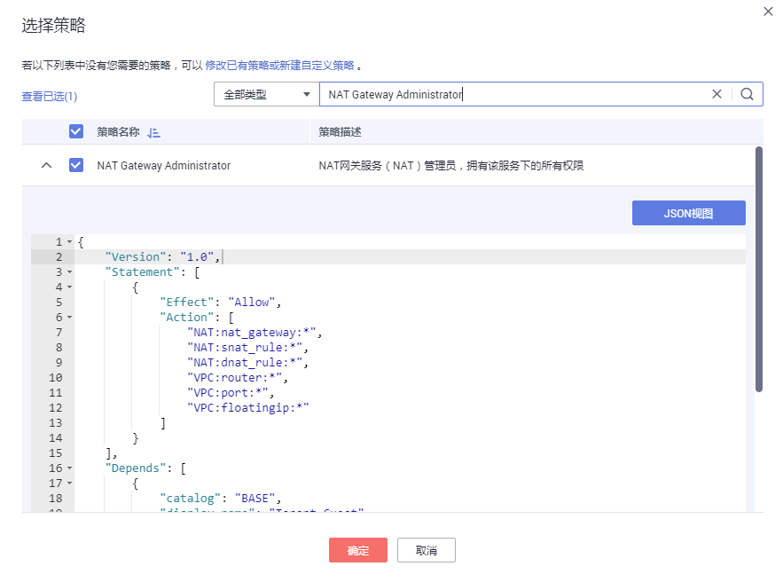

# 策略语法：RBAC<a name="zh-cn_topic_201905307"></a>

## 策略语法<a name="zh-cn_topic_0171158983_section186518419401"></a>

给用户组选择策略时，单击策略下方的，可以查看策略的详细内容，以“NAT Gateway Administrator”为例，说明RBAC策略的语法。

**图 1**  RBAC策略语法<a name="fig2218122415129"></a>  


```
{
    "Version": "1.0",
    "Statement": [
        {
            "Effect": "Allow",
            "Action": [
                "NAT:nat_gateway:*",
                "NAT:snat_rule:*",
                "NAT:dnat_rule:*",
                "VPC:router:*",
                "VPC:port:*",
                "VPC:floatingip:*"
            ]
        }
    ],
    "Depends": [
        {
            "catalog": "BASE",
            "display_name": "Tenant Guest"
        }
    ]
}
```

-   Version：Version：策略的版本号，RBAC策略版本为“1.0”，细粒度策略版本为“1.1”。
-   Statement：策略的授权语句，包含Action（授权项）和Effect（作用），Action和Effect结合构成用户具备的权限。
    -   Action（授权项）：操作权限，格式为：服务名:资源类型:操作，支持单个或多个操作权限，支持通配符号\*，通配符号\*表示所有。

        示例："nat:\*:get"，其中nat为服务名，\*为资源类型，get为操作，该授权项表示NAT网关所有的资源类型的查询权限。

    -   Effect（作用）：定义Action中的操作权限是否允许执行。Allow：允许；Deny：拒绝。

        系统预置策略仅包含允许的授权语句，自定义策略中可以同时包含允许和拒绝的授权语句，同一个Action的Effect如果既有Allow又有Deny时，遵循Deny优先的原则。


-   Depends：策略的依赖关系，给用户组授予该策略时，需要同时勾选依赖的权限，否则该策略不会生效。
    -   catalog：依赖的策略的所属服务。
    -   display\_name：依赖的策略的名称，“NAT Gateway Administrator”依赖Base服务的“Tenant Guest”策略。


