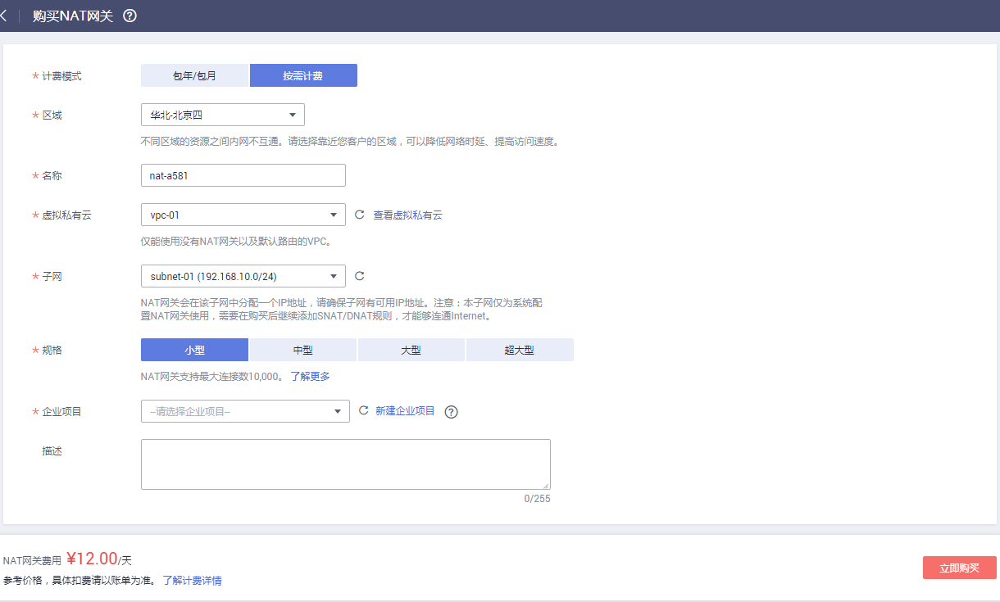

# 购买NAT网关

## 操作场景

如果您要通过NAT网关访问公网或为公网提供服务，则需要购买NAT网关。

## 前提条件

-   购买NAT网关必须指定NAT网关所在VPC、子网、NAT网关规格。
-   确认VPC下没有默认路由。（“华北-北京四”无此限制）

## 操作步骤

1.  登录管理控制台。
2.  在管理控制台左上角单击，选择区域和项目。
3.  在系统首页，单击“网络 \> NAT网关”。
4.  在NAT网关页面，单击购买NAT网关，进入NAT网关购买页面。

    **图 1**  购买NAT网关  
    

5.  根据界面提示，配置NAT网关的基本信息，配置参数请参见[表1](#zh-cn_topic_0201532882_table27487005195751)。

    **表 1**  参数说明

    
    <table><thead align="left"><tr id="zh-cn_topic_0201532882_row9940336195751"><th class="cellrowborder" valign="top" width="31.740000000000002%" id="mcps1.2.3.1.1">
参数

    </th>
    <th class="cellrowborder" valign="top" width="68.26%" id="mcps1.2.3.1.2">
参数说明

    </th>
    </tr>
    </thead>
    <tbody><tr id="zh-cn_topic_0201532882_row11053428162048"><td class="cellrowborder" valign="top" width="31.740000000000002%" headers="mcps1.2.3.1.1 ">
区域

    </td>
    <td class="cellrowborder" valign="top" width="68.26%" headers="mcps1.2.3.1.2 ">
NAT网关所在的区域。

    </td>
    </tr>
    <tr id="zh-cn_topic_0201532882_row23152322195751"><td class="cellrowborder" valign="top" width="31.740000000000002%" headers="mcps1.2.3.1.1 ">
计费模式

    </td>
    <td class="cellrowborder" valign="top" width="68.26%" headers="mcps1.2.3.1.2 ">
NAT网关支持按需计费、包年/包月。

    </td>
    </tr>
    <tr id="zh-cn_topic_0201532882_row32613315195751"><td class="cellrowborder" valign="top" width="31.740000000000002%" headers="mcps1.2.3.1.1 ">
名称

    </td>
    <td class="cellrowborder" valign="top" width="68.26%" headers="mcps1.2.3.1.2 ">
NAT网关名称。最大支持64个字符，仅支持数字、字母、_（下划线）、-（中划线）。

    </td>
    </tr>
    <tr id="zh-cn_topic_0201532882_row27553870195751"><td class="cellrowborder" valign="top" width="31.740000000000002%" headers="mcps1.2.3.1.1 ">
虚拟私有云

    </td>
    <td class="cellrowborder" valign="top" width="68.26%" headers="mcps1.2.3.1.2 ">
NAT网关所属的VPC。只能选择没有被其他NAT网关使用和没有默认路由的VPC（“华北-北京四”无此限制）。

    </td>
    </tr>
    <tr id="zh-cn_topic_0201532882_row47407746195751"><td class="cellrowborder" valign="top" width="31.740000000000002%" headers="mcps1.2.3.1.1 ">
子网

    </td>
    <td class="cellrowborder" valign="top" width="68.26%" headers="mcps1.2.3.1.2 ">
NAT网关所属VPC中的子网。

    
子网至少有一个可用的IP地址。

    </td>
    </tr>
    <tr id="zh-cn_topic_0201532882_row3011590195751"><td class="cellrowborder" valign="top" width="31.740000000000002%" headers="mcps1.2.3.1.1 ">
规格

    </td>
    <td class="cellrowborder" valign="top" width="68.26%" headers="mcps1.2.3.1.2 ">
NAT网关的规格。

    
NAT网关共有小型、中型、大型和超大型四种规格类型，可通过“了解更多”查看各规格详情。

    </td>
    </tr>
    <tr id="zh-cn_topic_0201532882_row98721653013"><td class="cellrowborder" valign="top" width="31.740000000000002%" headers="mcps1.2.3.1.1 ">
企业项目

    </td>
    <td class="cellrowborder" valign="top" width="68.26%" headers="mcps1.2.3.1.2 ">
配置NAT网关归属的企业项目。当NAT网关配置企业项目时，该NAT网关将归属于该企业项目。当没有指定企业项目时，将默认使用项目名称为default的企业项目。

    </td>
    </tr>
    <tr id="zh-cn_topic_0201532882_row2219225792544"><td class="cellrowborder" valign="top" width="31.740000000000002%" headers="mcps1.2.3.1.1 ">
描述

    </td>
    <td class="cellrowborder" valign="top" width="68.26%" headers="mcps1.2.3.1.2 ">
NAT网关信息描述。最大支持255个字符。

    </td>
    </tr>
    <tr id="zh-cn_topic_0201532882_row105571852134014"><td class="cellrowborder" valign="top" width="31.740000000000002%" headers="mcps1.2.3.1.1 ">
购买时长

    </td>
    <td class="cellrowborder" valign="top" width="68.26%" headers="mcps1.2.3.1.2 ">
NAT网关购买时长。

    </td>
    </tr>
    </tbody>
    </table>

    配置完成上述信息，会显示NAT网关配置费用，可通过“了解计费详情”查看计费信息。

6.  单击“立即购买”，在“规格确认”页面，您可以再次核对NAT网关信息。
7.  确认无误后，单击“提交”，开始创建NAT网关。

    NAT网关的创建过程一般需要1-5分钟。

8.  在“NAT网关”列表，查看NAT网关状态。

